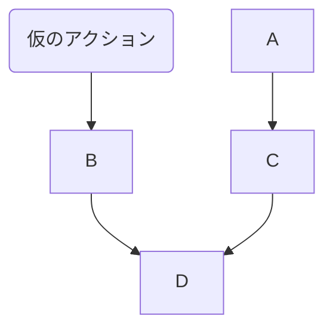

## 自分の環境でこのファイルを見る
`Ctrl + Shift + v`
## リンク
* DB Viewer(DB Browser for SQLiteをDLするのめんどくさいのでこれ使う)
  * [SQLite Viewer Web App](https://sqliteviewer.app/)
  * `db/development.sqlite3`をDLして使う

## 章を始める前にやること
* branch切る
``` bash
$ git switch -c 章の名前etc
```

## MVCについて
|役割|担当|Railsでの具体例|
|--|--|--|
|Model|	データ・ロジック|app/models/user.rb|
|View|表示（HTML生成）|app/views/users/show.html.erb|
|Controller|処理の振り分け|app/controllers/users_controller.rb|
* モデル
  * データベースと連携し、データ構造とビジネスロジックを定義
  * バリデーション、リレーション、スコープなどを記述
  * ActiveRecord によりDBとのやりとりを行う
* ビュー
  * ユーザーに返す画面（HTML）を生成
  * .html.erb などテンプレート言語で記述
  * コントローラーから渡されたデータを表示
``` erb
<h1><%= @user.name %>さんのプロフィール</h1>
```
* コントローラ
  * HTTPリクエストを受け取り、ModelとViewをつなぐ
  * 必要なデータをModelから取得し、Viewに渡す
  * ルーティングにより呼び出される

### MVCの流れ
```
1. ブラウザから /users/1 にアクセス
↓
2. ルーティングにより users#show が呼ばれる
↓
3. Controller が User.find(1) を実行 → Model にデータ要求
↓
4. Controller が View（show.html.erb）に @user を渡す
↓
5. View がHTMLを生成し、ブラウザに返す
```
## MVCモデルの+DB作成
### モデル
``` bash
$ rails generate model User name:string email:string
```

* 生成されるファイル一覧

|ファイルパス|説明|
|--|--|
|app/models/user.rb|Userモデル本体。ActiveRecordのクラス。バリデーションなどを書く|
|db/migrate/[タイムスタンプ]_create_users.rb|テーブル構造を定義するマイグレーションファイル（name, email カラム付き）|
|test/fixtures/users.yml（または spec/factories/users.rb）|テストデータのひな型（fixtures または factory_bot）|
|test/models/user_test.rb（または spec/models/user_spec.rb）|ユニットテスト用ファイル（MinitestやRSpec）|


<details>
  <summary>ディレクトリ構成</summary>
  
```
root/
  ├──app/
  │   └── models/
  │       └── user.rb            # モデル本体
  ├──db/
  │   └── migrate/
  │       └── [タイムスタンプ]_create_users.rb  # マイグレーションファイル
  └──test/ （または spec/）
     ├── fixtures/
     │   └── users.yml          # テストデータ（Minitest）
     └── models/
         └── user_test.rb       # モデルのテストコード
```

</details>


> **💡**
> この時点ではDBにテーブルが作られるわけではない

> **❓ DBとモデル、どっち先にgenerateしても大丈夫か**
> どちら先にやっても原則的には大丈夫
> ただし、モデルを先にgenerateするのが一般的

* カラム追加したい場合
``` bash
# 基本構文
$ rails generate migration Add<カラム名（複数可）To<テーブル名> <カラム名>:<型> ...
# 例
# ageを追加(snakeでも可能)
# user.rbには追加したカラムは追加されない
$ rails generate migration AddAgeToUsers age:integer
# ageとbioとadminを追加
$ rails generate migration AddFieldsToUsers age:integer bio:text admin:boolean
```
* indexの追加
``` bash
$ rails generate migration add_index_to_users_email
```
### コントローラー
``` bash
$ rails generate controller Users new
$ rails generate controller Users
```

|||
|--|--|
|newがある場合|UserController だけ作られ、アクションは空|
|newがない場合|UsersController に new アクションが追加され、app/views/users/new.html.erbも作られる|
<details>
  <summary>もうすでにあるコントローラーをまた作った場合</summary>

  エラーになる
  ```
  The name 'UsersController' is either already used in your application or reserved by Ruby on Rails. Please choose an alternative or use --skip-collision-check or --force to skip this check and run this generator again.
  ```
</details>

* 生成されるファイル一覧

|ファイルパス|説明|
|--|--|
|app/controllers/users_controller.rb|UsersController が作成され、new アクションが定義される|
|app/views/users/new.html.erb|new アクション用のビュー（HTMLテンプレート）|
|test/controllers/users_controller_test.rb|	コントローラ用のテストファイル|
|app/helpers/users_helper.rb|ビューヘルパー。必要に応じてビュー用メソッドを追加できる|
|config/routes.rb|get 'users/new' のルートが自動追加される（1行）|


<details>
  <summary>ディレクトリ構成</summary>
  
```
root/
  ├── app/
  │ ├── controllers/
  │ │   └── users_controller.rb        # コントローラー本体
  │ ├── views/
  │ │   └── users/
  │ │       └── new.html.erb           # newアクション用のビュー
  │ └── helpers/
  │     └── users_helper.rb            # ビューヘルパー
  ├── test/ （または spec/）
  │ └── controllers/
  │    └── users_controller_test.rb   # コントローラーのテストコード
  └── config/
        └── routes.rb                      # ここに get 'users/new' が自動で追加される
```

</details>

### ビュー

* `rails generate view`　は存在しない
  * `rails generate controller `でビューも作られるため


### TEST
```
rails generate integration_test users_signup
```
### DB
``` bash
$ rails db:migrate
# リセット
$ rails db:migrate:reset
```

`db/migrate/タイムスタンプ_～.rb`(モデルを作成したときにできるファイル)をもとにDBが作成される

* 生成されるファイル一覧
|ファイルパス|説明|
|--|--|
|db/development.sqlite3|SQLiteで作られた「実際のデータベースファイル」|
|db/schema.rb（または db/structure.sql）|現在のDB構造を表すファイル|
|schema_migrations テーブル（DB内）|のマイグレーションがすでに実行済みか（=up済み）を記録している|


|コマンド|内容|
|--|--|
|rails db:migrate	|マイグレーションを実行（up）|
|rails db:rollback|	直前のマイグレーションを取り消す（down）|
|rails db:migrate:status|	実行済み/未実行のマイグレーション一覧を表示|


### 操作

memo_db.md参照

## rails console 
### 接続/終了
``` bash
# 基本
$ rails c
>> exit
# sandbox(※railsに接続したところからsandboxモードにはなれない。必ずoption指定して接続すること)
$ rails console --sandbox 
$ rails c -s

``` 
### 操作
* このときはまだDBを見ているわけではない
``` ruby
# Userから作ったオブジェクト。User.newと言うインスタンス
>> User.new
=> #<User:0x000074da185c51e0 id: nil, name: nil, email: nil, created_at: nil, updated_at: nil

# Userと結果は同じだが、同じものではない。User.new で作ったインスタンスのクラス
>> User.new.class
=> User(id: integer, name: string, email: string, created_at: datetime, updated_at: datetime)

# User クラスそのもの(app/models/unser.rbの中身)
>> User
=> User(id: integer, name: string, email: string, created_at: datetime, updated_at: datetime)

# 継承元の表示
>> User.new.class.superclass
=> ApplicationRecord(abstract)
```


## テスト

* テスト実行コマンド
  * test/models/ のテストだけを実行
``` bash
$ rails test:models
```


## Ruby on Railsにおける用語
|用語|意味|
|--|--|
|マイグレーション|移動や移行|
|ERB|Ruby on Railsのテンプレートエンジン|


## router周辺


|ディレクトリ・ファイル名|役割|
|routes.rb|URLとコントローラ・アクションの対応を定義|
|controllers/users_controller.rb|URLに対応する処理を行うアクションを定義|

|views/static_pages/about.html.erb|about アクションに対応するHTMLビュー|
|views/layouts/application.html.erb|全ビューに共通するHTMLレイアウト|
|views/users/new.html.erb	|users#newに対応するユーザー登録画面ビュー|

